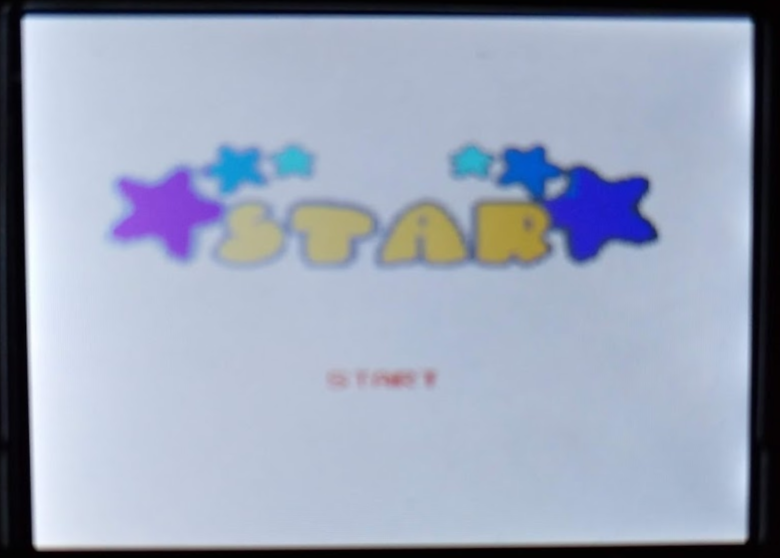

# orb gaming Mini Arcade Machine - 240 in 1

I got an "Orb Gaming Mini Arcade Machine", with 240 games.

It is the one you can find in https://thumbsupuk.com/Products/Mini_Arcade_Machine . There two (at least) more recent versions, which you can distinguish because the games menu has categories on what I'm calling versions 2 and 3. The 3rd version doesn't say 'orb Gaming' on the front, either. I do not know if the actual games on those versions are the same.

The sort of guy that would find such a machine interesting (yeah, me) is also the sort of guy who would enjoy having more info about the games that are available in here, including a list of games, information about them, links and so on. Unfortunately, a few of these games don't seem to be documented anywhere. So... well, I decided to create a small repository -- for now just one markdown file, to list the games, add info about them, and so on. If you know more about some of these games (even if you don't have them on the same mini arcade machine!), feel free to open issues or submit pull requests.

##   1 - F22

### About the game

This is the Waixing edition of F-22. The name of the game seems to be "F-22", even if the menu calls it "F22". More info here: https://tcrf.net/F-22

### My personal progress

I can reach the 1st level boss, but not kill it.

This edition is supposed to have 3 levels.

##   2 - Vanguard

### About the game

This is not the space shooter arcade Vanguard, but the tank shooter. A video of it in action can be seen here: https://www.youtube.com/watch?v=eR--6_kXMFc

### My personal progress

I can reach stage 3.

##   3 - Abscondee

### About the game

Pick the items, avoid the traps, reach the exit -- all within the alloted time. More info here: https://tcrf.net/Abscondee

### My personal progress

I can reach stage 2.

##   4 - Aether Cruiser

### About the game

https://tcrf.net/Aether_Cruiser

### My personal progress

I can reach stage 2.

##   5 - Aim Cruise

### About the game

https://tcrf.net/Aim_Cruise

### My personal progress

Aim Cruise game's over if you manage to play for 99 seconds without losing, which I do, reaching level 4.

##   6 - Air Alert

### About the game

This seems to be a variant to another "Air Alert": https://www.youtube.com/watch?v=zYnUBDAu8V4 . This one has only the choice of "1 Plane" on the main menu, has black background there and yellow letters, instead of the purple and orange seen on that video. The game has audio, but the title screen has not.

### My personal progress

At least this version of Air Alert comes with infinite lives.

##   7 - Star

### About the game

I find no information about this game online. This is *not* the hack of the Snafu game, of the same name. For better reference, here's a picture of the game's title screen:

### Personal progress

I've played this game until level 3, during which I decided to quit.

##   8 - Levin Action

### About the game

This is a modded version of Defender.

### Personal progress

I reach wave 2.

##   9 - Animal Blockes

### About the game

This is a Mahjong game, where the blocks are images of animals. A reference to its existence can be found here: https://tcrf.net/Angry_Birds_(NES,_2012)

### Personal progress

Stage 4.

##  10 - Animal Contest

### About the game

This is a game with the mechanics of the "War" cards game. More info here: https://tcrf.net/Animal_Contest

### Personal progress

What can be said of a game like this? You play, if you're lucky you win, if you're not you loose.

##  11 - Balloon Shoot

### About the game

https://www.youtube.com/watch?v=ieuMVuwarQM&feature=youtu.be

### Personal progress

You have 60 seconds to do your best, and that's it...

## 12 - Bicycle

### About the game

There is more than one variant of this game, because when I initially searched about it, I found a video (unfortunately no longer available) of the same game, but with more options in the start menu. On this variant, the only starting choice is level 1.

### Personal progress

I reach level 2.

## 13 - Blob Buster

### About the game

Blog Buster is [an hack](https://www.romhacking.net/hacks/1410/) of [Dig Dug II](https://en.wikipedia.org/wiki/Dig_Dug_II). But in this arcade, even Blog Buster was hacked: the main screen only shows the 1 Player option, but does not hide the 2UP text on the top right corner. Nothing under the 1 Player option shows (including the credits).

### Personal progress

I reached level 5.

## 14 - Boat Race

### About the game

A "road fighter" hack: same game, different graphics. (See also number 71 on this list).

### Personal progress

6400 (level 1).

## 15 - Brother Ball

### About the game

Some info [here](https://tcrf.net/Brother_Ball). The levels get bigger, but the difficulty does not increase.

### Personal progress

I reached stage 7 before I quited. Might be interesting to try to play it through, just to figure out how many levels are there... and as a resistence to boredom test.

## 16 - Bug

### About the game

Fumigate a cat!

### Personal progress

Level 4.

## 17 - Bug Catcher

### About the game

This is a game about a cat that eats.

### Personal progress

I reached level 9, and quit'ed. It's easy not to loose in this game.

## 18 - Busy Bar

### About the game

You are a mouse working on a bar, serving drinks on tables. The bar is busy, and it gets busier as you progress.

### Personal progress

Level 5.

## 19 - Candy Workshop

### About the game

Some info [here](https://tcrf.net/Candy_Workshop). If you play long enough without loosing it games over.

### Personal progress

I reached the "end" (played long enough to loose by not loosing).

## 20 - Checkers

### About the game

This is actually the [checkers](https://en.wikipedia.org/wiki/Draughts) game called [Checker](https://tcrf.net/Checker), but with title name changed to 'Checkers'.

### Personal progress

I've won a few times. There are no difficulty levels, and this isn't an hard one, which makes the game boring after a while.

## 21 - Contest

### About the game

Same as Contest 2004, AFAICS, only change being that "2004" is not written on the title screen: https://tcrf.net/Contest_2004 .

### Personal progress

Three levels loop, I manage do to all without loosing lives.

## 22 - Cookies Labyrinth

### About the game

https://youtu.be/PqPSgrModxM

### Personal progress

5 levels, I do them all.

## 23 - Nature Clan: Pindable Crystal Ball

### About the game

* https://tcrf.net/Nature_Clan:_Pindable_Crystal_Ball
* http://bootleggames.wikia.com/wiki/Pindable_Crystal_Ball
* single player version

The entry #23 shows this game as "Crystal Ball." It will later appear, exactly the same game, on entry #72, under the name "Pindable".

### Personal progress

I get to level 5.

## 24 - Crystal Blast

### About the game

https://youtu.be/Z2ZsD1EdA5o

### Personal progress

I get up to level 10.

## 25 - danger bridge

https://tcrf.net/Danger_Bridge

I reach level 10.

## 26 - deformable

racing game against PC, three levels and then you win

## 27 - dejectile

Bomberman 2002 clone, I get to stage 4

## 28 - egg contest

lost on level 4

## 29 - escapeway

game over after 99 seconds

## 30 - Fairy's Treasure

905 points (level 1)

## 31 - fated pirate

level 2

## 32 - final blood

level 3

## 33 - fish story

level 2

## 34 - Fling Ball

### About the game

On this 1P only version, the box to choose from 1P or 2P exists, but there is nothing seen in there.

You play 5 rounds against COM, the player with more points in the end wins.

A video of the 2P version of the game can be seen here: https://www.youtube.com/watch?v=P3gis0giPhc .

### Personal Progress

I manage to win. 

## 35 - Forest Adventure

### About the game

Platform game (jump and don't fall). A video of it being played can be seen here: https://www.youtube.com/watch?v=XLGOwJm37UM . It has ten levels.

### Personal Progress

I manage to win (ie, complete the 10 levels). 

## 36 - Frantic Fishing

Never ending game, since the "time" starts on 0.

https://www.youtube.com/watch?v=psSquw1fXek

## 37 - Fruit Gift

http://wiki.nesbbs.com/index.php?title=Fruit_Gift

This game provides unlimited lives, I've reached level 4 before I quitted.

## 38 - Fruit Pig

This game provides unlimited lives, I've reached level 10 before I quitted.

## 39 - Ghost Castle

## 40 - Golden Bird

## 41 - Goodhand

## 42 - Gradirs

## 43 - Greeds

## 44 - Hammer And Nail

## 45 - Happy Match

## 46 - Hassle

## 47 - Highcard

## 48 - Hurry Burry

## 49 - Ice Ocean

## 50 - IQ Champeon

## 51 - Island

## 52 - Jumping Kid

## 53 - Jump Jump

## 54 - Lattice Winner

## 55 - Law Purge

## 56 - Lightning

racing game against PC, three levels and then you win

## 57 - Little Witch

## 58 - Magic Egg

## 59 - Masked Man

## 60 - Masked Man II

## 61 - Masked Man III

## 62 - Meccano

## 63 - Mirror Devil Word

## 64 - Mouse Hero

## 65 - Mouse Snare

## 66 - Mowing

## 67 - Music Moment

## 68 - Nut Cracky

## 69 - Octupus

## 70 - Battle

Galaga clone, reach level 6

## 71 - Panzer Fly Car

### About the game

Panzer Fly Car is a "Road Fighter hack". More info: https://piratedgamemuseum.fandom.com/wiki/Road_Fighter . A video can be seen here: https://www.youtube.com/watch?v=CCxpBNN7xX0 . In this version, the menu has only the "Level 1" option. See also number 14 on this list, which is another hack of the same game.

### Personal Progress

Tracked on entry #14 of this list.

## 72 - Nature Clan: Pindable Crystal Ball

Same as #23, see that entry for more info.

## 73 - Pizza Boy

### About the game

https://www.youtube.com/watch?v=j349oNGMo5o

### Personal Progress

Lost on stage 5.

## 74 - Police Dog

### About the game

While the menu calls it "Police Dog" its full name according to the title screen is "Police Dog Lasy". The game has 10 stages, each with increasing difficulty, while, after a robber has planted his loot during the night on a field, the player controlling a police dog will need to spot the places where the loot was planted. A video of que game being played from start to finish can be seen at https://www.youtube.com/watch?v=p5_D5kJYZ1g . According to https://tcrf.net/Police_Dog_Lasy , there are two versions of this game, with and without sound. The version in this machine is the one with sound.

### Personal Progress

Lost in Stage 4, with 2400 points.

## More info

This documentation project is licensed CC0.
